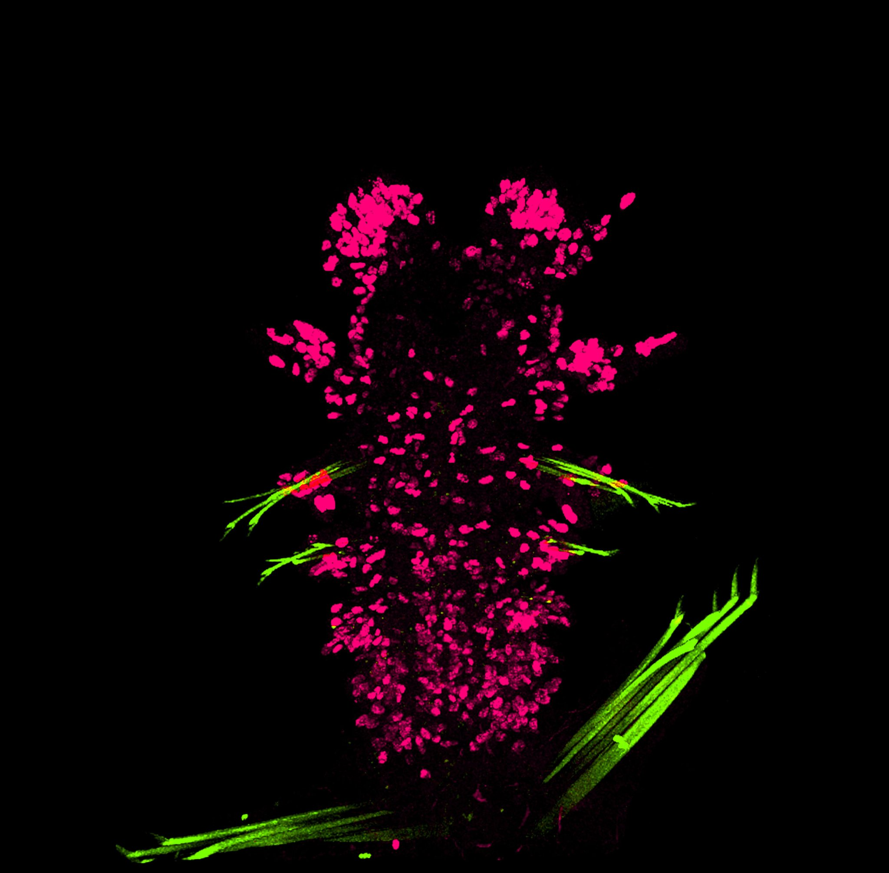
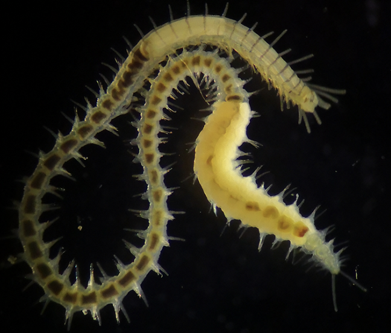

## **Regenerative Systems Biology**

{height="348" fig-align="left"}

I study regeneration and reproduction in marine segmented worms, also known as annelids. During my PhD, I explored the relationship between regeneration and reproduction from an evolutionary perspective. Using tools such as RNA sequencing, bioinformatics, and immunohistochemistry, I characterized cellular proliferation and the transcriptomic profile of anterior and posterior body regeneration in a group of segmented worms called syllids. Through this work, I offered some evolutionary insights into how regeneration influenced the diversification of reproductive modes in syllids.

Currently, my postdoctoral research focuses on understanding how regeneration influences germ cell proliferation and differentiation. Remarkably, these worms are able to regenerate their germ cells without compromising fertility. Along this journey, we found that regeneration does not alter sex, and we discovered sex-biased gene expression in the germ cell tissues of the polychaete *Platnereis dumerilii* [(Ribeiro et al. 2025)](https://doi.org/10.1242/dev.204513). Building on these findings, I expanded my research to identify the effects of regeneration in a systemic level. Unraveling these processes may reveal principles that could one day help us manipulate cell resilience across diverse cell types and organs, inspired by regenerative mechanisms.

## **Annelid diversity and evolution**

{height="348" fig-align="left"}

Ranny has devoted many years to studying the diversity of annelids Embarking on her scientific journey by collecting specimens from the mangroves of her hometown, São Luís (MA), Brazil, her initial venture into science involved taxonomical description of new species. Having overseen two projects for Bachelors and a Masters degree, and through collaborative research set alongside, she has described 15 annelid species. Furthermore, her expertise in taxonomy has facilitated her contributions to ecology, particularly in evaluating environmental health within both impacted and preserved marine ecosystems.
