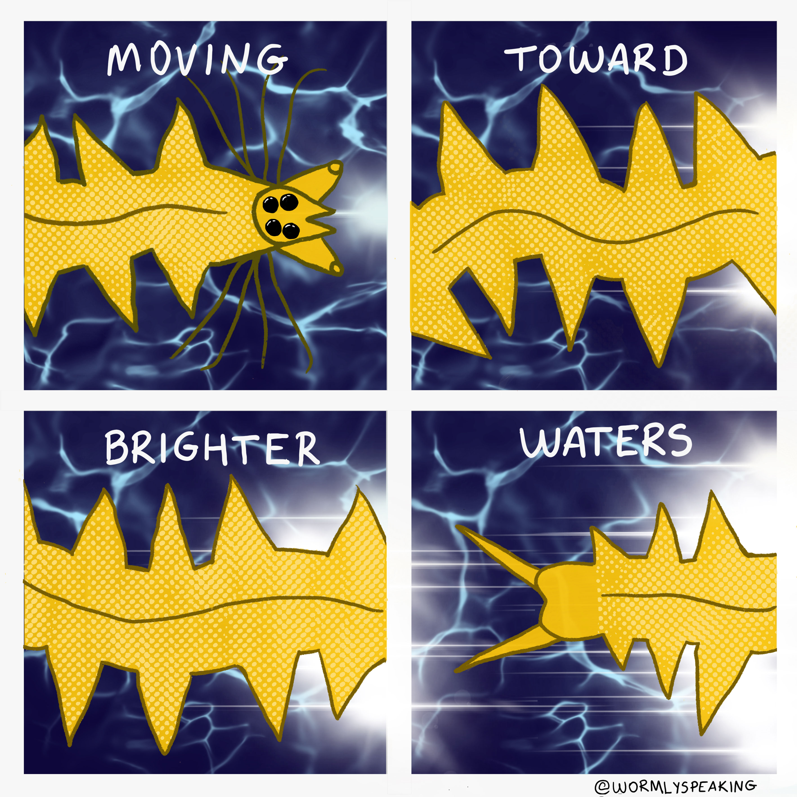
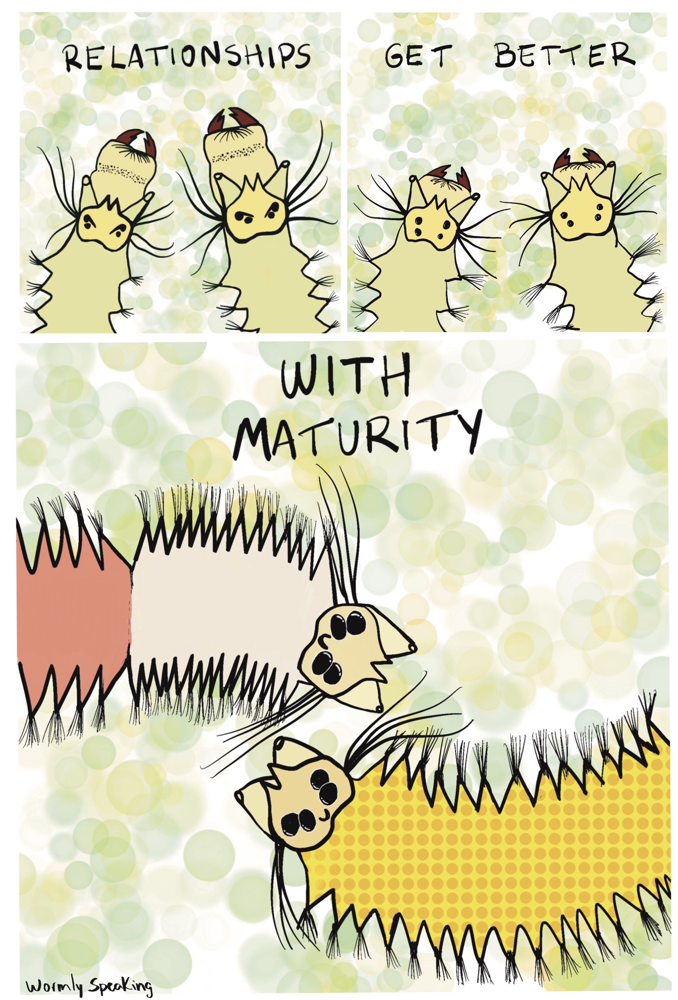
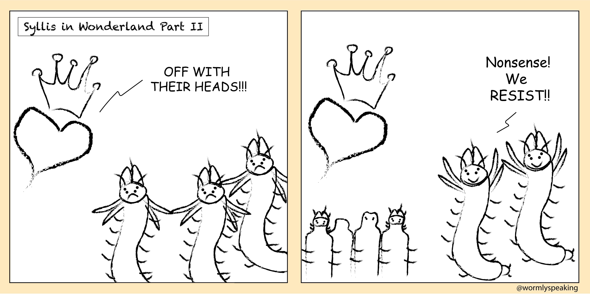
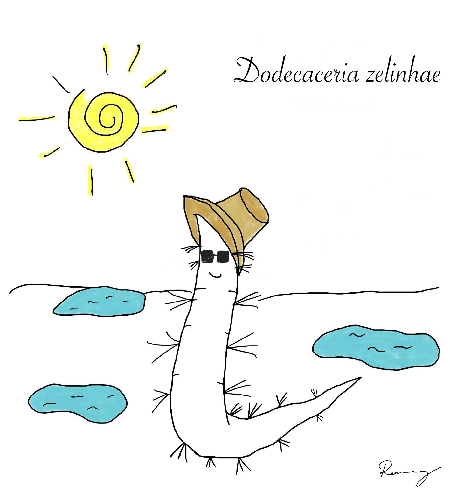
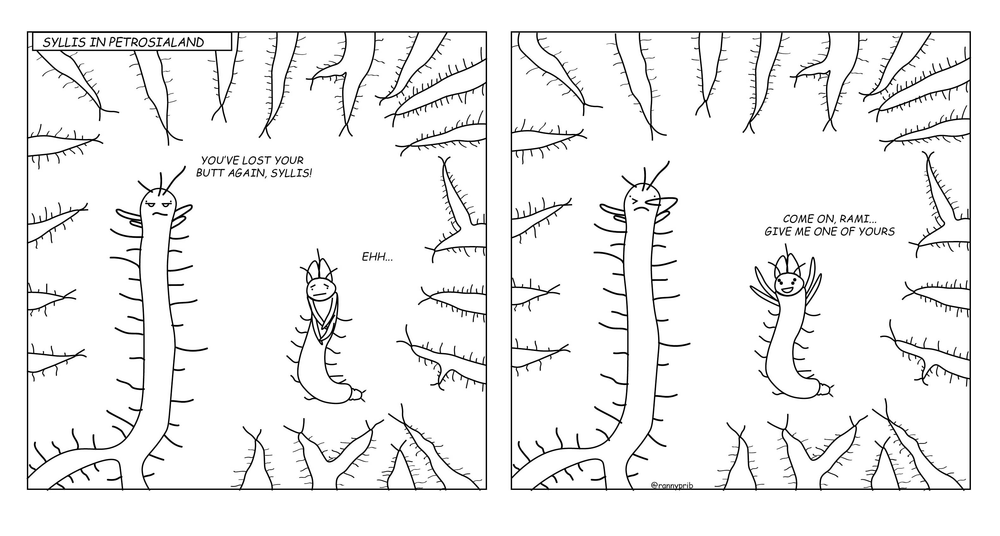
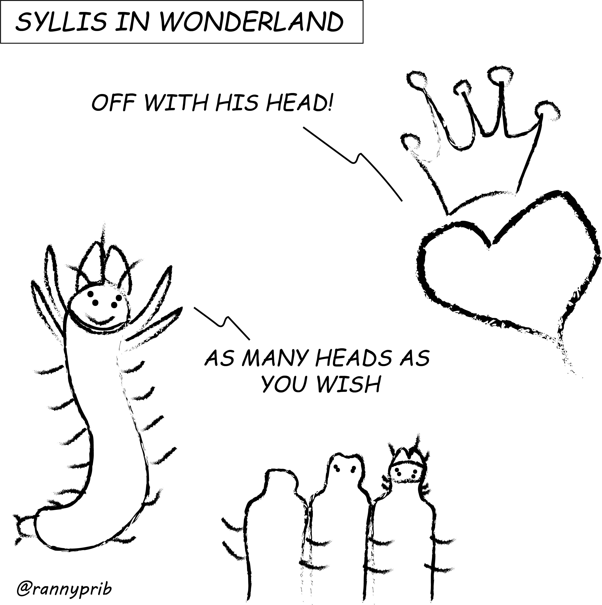

I am a sci-cartoonist! I believe that comics are a fun way to communicate complex ideas. So, I started illustrating them to share the stories behind my research papers, blending storytelling with science in an engaging format.

From this spark, I launched **Wormly Speaking**, a space where the fascinating, often-overlooked polychaete worms get their time to shine. Through this project, my mission is to empower and inspire us with hopeful stories while also sharing the remarkable traits of these worms, such as their unique regenerative and reproductive biology. Take a peek at the stories I’ve created so far.

Follow on Instagram to see more stories: <https://www.instagram.com/wormlyspeaking/>

![**Breaking free.** Some worms begin new life by letting part of themselves go. They grow special reproductive bodies called stolons. When the time comes, the stolons detach from the parent worm and swim freely through the water. There, they transform, find partners, and release the next generation into the sea. The parent worm survives this separation. It regenerates the missing body region and continues living, carrying the possibility of future cycles. This art is inspired by polychaetes of the family Syllidae.](images/clipboard-2453491839.jpeg)

::: {layout-nrow="2" layout-valign="bottom"}
{group="my-gallery" height="328px"}

{group="my-gallery" height="328"}

{group="my-gallery" width="6110"}

{group="my-gallery" height="328px"}
:::
